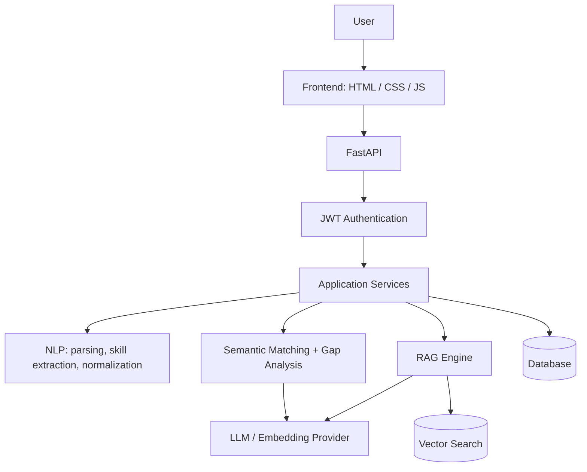

# 🎯 AI Skill Gap Analyzer

 **Upload a resume. Paste a job description. Know exactly what to learn next.**

An AI-powered career intelligence platform that compares a candidate's resume against a target job, finds the skill gaps, calculates an **explainable** match score, and builds a personalized learning roadmap, project ideas, and interview practice.

---

## 🤔 The Problem

Students and freshers apply to dozens of jobs without knowing:

- What skills do I already have?
- What does this job actually require?
- What am I missing, and what should I learn **first**?
- Why is my resume getting rejected?

Most resume tools give a vague score. This project gives **answers you can act on**.

## ✨ What It Does

| Feature | Description |
|---|---|
| 📄 **Resume parsing** | Reads PDF, DOCX, and TXT resumes |
| 🧾 **Job description parsing** | Extracts required skills from any pasted JD |
| 🧠 **Semantic skill matching** | Understands that "ML" ≈ "Machine Learning" using embeddings, not just keywords |
| 📊 **Explainable match score** | Shows *why* the score is what it is, skill by skill |
| 🟢🟡🔴 **Gap analysis** | Splits skills into strong, partial, and missing |
| 🗺️ **Learning roadmap** | AI-generated, prioritized plan for closing the gaps |
| 🛠️ **Project recommendations** | Portfolio projects that target your missing skills |
| 🎤 **Interview practice** | Role-specific questions, mock interviews, and AI feedback |
| 💬 **AI career assistant** | RAG-powered chat over a career/learning knowledge base |
| 📈 **Progress tracking** | History of past analyses and improvement over time |
| 📑 **Report export** | Download a final career-gap report |

## 🏗️ Architecture

**Design principles**

- **Layered:** API routes stay thin, logic lives in `services/`, AI code lives in `ai/`.
- **Provider-agnostic LLM layer:** swap OpenAI-compatible providers without touching business logic.
- **Explainable first:** the match score comes from transparent rules and embeddings, not a black-box prompt. The LLM is used for *explaining and recommending*, not for inventing the score.
- **Config via environment variables:** no secrets in code.
